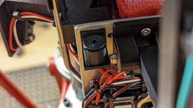

# PrimerCop

## A primer watchdog for a Hornady Lock-n-Load AP press

If you forget to press the handle forward at the end of a loading cycle, 
the primer is not seated in the case.  

On a progressive press this is a problem.
It is a problem because the next step in the process is loading powder.  If there 
is not a primer plugging the primer cup, when your 'finished' round is ejected 
into the tray, powder starts falling out the case generally making a mess.

That's why I designed and use PrimerCop.  It keeps track of how many primers I've 
used (secondary function), and it emits a long beep until I press the arm forward
to seat the primer (primary function).

PrimerCop uses two sets of Adafruit IR break-beam sensors which are triggered 
at the top and bottom of the cycle.

A Drok buck converter provides power to a Raspberry Pi Pico microcontroller 
running a Micropython app I wrote.

The mounts for everything are designed in OpenSCAD and are currently printed
in PLA on a Prusa Mk3s.  I'm seriously thinking about redoing those parts in ABS 
because PLA is a bit too sensitive to temperature, and I don't want anything to 
change while the press is stored away between uses.

### Changelog

12/8/22 - Version 2 of the Pi Pico software is working and available in the Code
section.  Three hardware buttons were added. Two of them allow for adding or subtracting 
from the 'primercount' variable.  The third button resets everything.

Debouncing the buttons is done in software, and works pretty good.

### Older notes

12/6/22 - Version 1 of PrimerCop is functioning.  It's not what I'd call ready
for prime time, but it does work.

I'm working on getting a set of 3 buttons added.  Designing the mounting
solution for the buttons is the task du jour.
